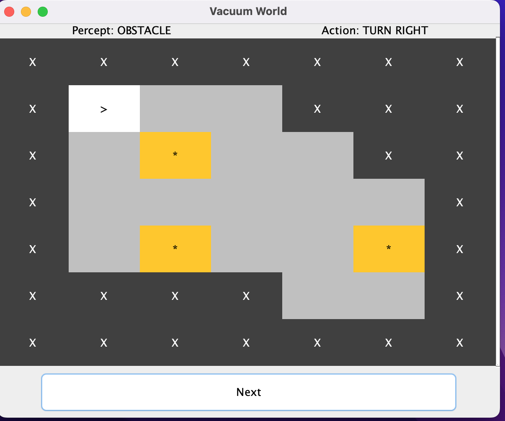
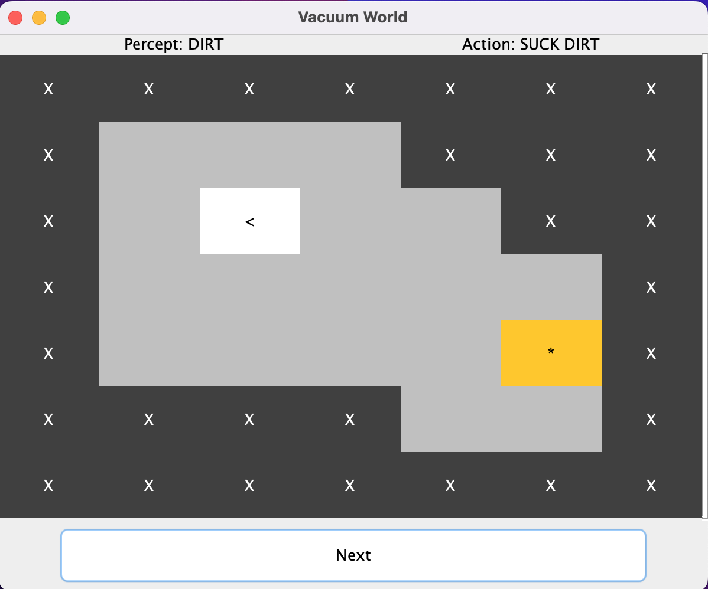

# Vacuum Cleaner Agent

This project implements an intelligent agent for a vacuum cleaner simulation in Java. The agent’s task is to autonomously clean a room while avoiding obstacles and minimizing movement. The agent operates in a grid environment where it can perceive dirt, obstacles, and bumps, and performs actions such as moving forward, turning, and cleaning.


### Agent Features:
- **Perception**: The agent can sense dirt, obstacles in front, and if it has bumped into something.
- **Actions**: The agent can move forward, turn left, turn right, suck dirt, and shut off once the room is clean.
- **Efficiency**: The agent is designed to minimize unnecessary movements and only clean when necessary.

---

## Features

1. **Grid Representation**: The environment is represented as a grid, where:
    - `X` represents walls or obstacles,
    - `*` represents dirt,
    - The agent (`A`, `>`, `<`, `V`) represents the vacuum cleaner, with the symbol indicating the agent’s direction.

2. **User Interface**:
    - A **Graphical User Interface (GUI)** built with Java Swing to display the grid and agent's movement in real-time.
    - A **"Next" Button** allows users to progress the simulation step by step.
    - The GUI shows the **Percept** and **Action** taken by the agent at each step.
    - The final score and performance evaluation are displayed after the agent shuts off.

3. **Simulation**:
    - The agent starts at position (1,1) facing north and cleans the room efficiently.
    - It cleans in a zig-zag traversal manner to ensure it covers the whole floor.
    - After cleaning, the agent returns to the start and shuts off.
    - The performance of the agent is evaluated based on moves, turns, bumps, and dirt cleaned.

---

## Setup and Installation

1. **Clone the repository**:
   ```bash
   git clone git@github.com:melaniefayne/VacuumAgentJava.git
   cd VacuumAgentJava
   ```

2. **Prerequisites**:
    - **Java 8+** installed.
    - Java IDE (IntelliJ recommended)

3. **Running the Project**:
    - Compile the Java files:
      ```bash
       javac -d out src/vacworld/agent/*.java src/vacworld/actions/*.java src/vacworld/*.java
      ```
    - Run the simulation:
      ```bash
      java -cp out vacworld.actions.VacuumWorld 
      ```

---

## How the Agent Works

- **Starting Position**: The agent begins in the upper-left corner (1,1), always facing north.
- **Perception**: At each step, the agent perceives its environment, including whether it’s on dirt, whether there’s an obstacle in front, and if it bumped into an obstacle on the last move.
- **Action Selection**: The agent uses the percepts to decide its next move, aiming to clean all dirt and avoid obstacles.
- **Completion**: Once the room is clean, the agent returns to its starting position and shuts off.

### Performance Metrics:
The agent is scored based on:
- **Moves**: Minimizing unnecessary movement,
- **Turns**: Reducing excessive turning,
- **Bumps**: Avoiding bumping into obstacles,
- **Dirt left**: Ensuring all dirt is cleaned before shutting off.

---

## Demo

### Initial Setup:


### Mid-simulation:


### Final Score:


---
